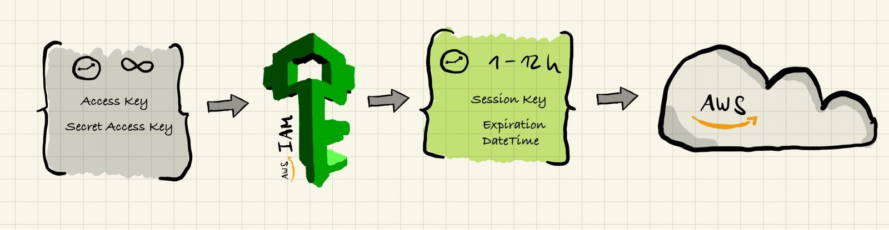
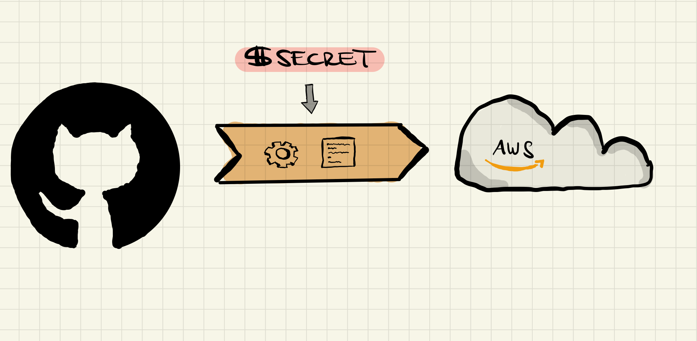
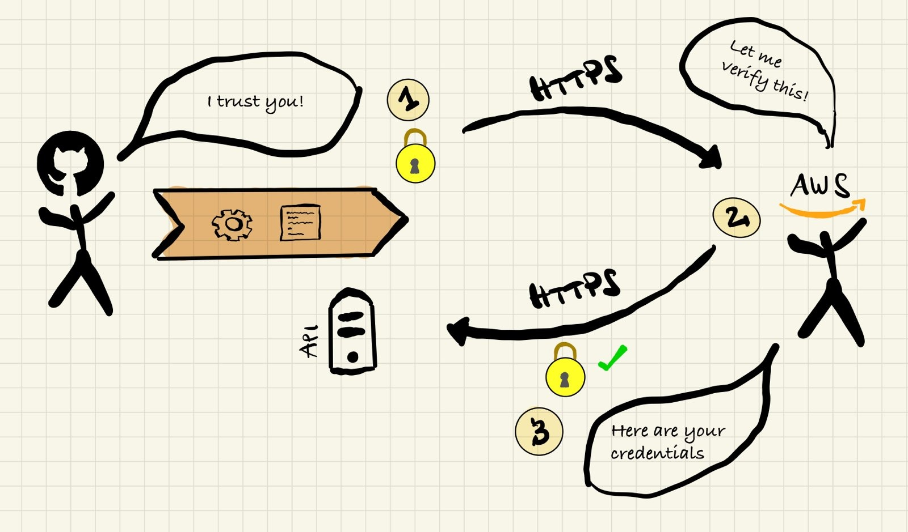
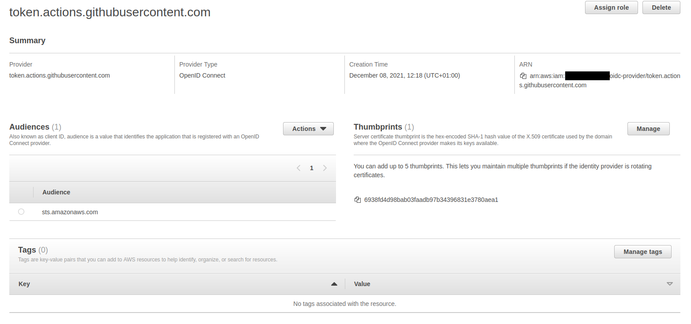

## Cloud Access Patterns for Humans and Machines

Anything that deals with cloud resources has to interact with one of the popular cloud APIs eventually. A popular way of doing this is through the relevant SDKs and CLIs, provided by the hyperscalers themselves, one of which is the [AWS CLI](https://aws.amazon.com/cli/). But before you are able to do anything in the AWS cloud you'll have to authenticate yourself against the [IAM API (Identity and Access Management)](https://aws.amazon.com/iam/) in order to get a set of short-lived credentials, which you then use to run arbitrary requests against any other AWS API.

The traditional way of doing this is by creating a pair of static credentials first, called "Access Key" and "Secret Access Key", which are both necessary in order to create so-called "session credentials" ("session" being the indicator for them being "short-lived", for a purpose). In a sense, you use a pair of long-lived credentials, which uniquely identify you as a human being, to create a set of short-lived credentials, which are not just identifying you but also carry an expiration date and are properly authorized by the IAM API to access any resources you desire.



This credential exchange has one very fatal flaw: whoever has access to your "Access Key" and "Secret Access Key" can essentially impersonate you without any further recourse. Every year, [hundreds of thousands of key pairs and other API keys are leaked on popular source control providers such as GitHub](https://www.zdnet.com/article/over-100000-github-repos-have-leaked-api-or-cryptographic-keys/), and what's worse, most folks aren't even aware their keys have been compromised until it is too late. Tens of thousands to hundreds of thousands of dollars in damages are the consequence.

The common advise to protect your access credentials is to rotate your static credentials frequently, and to use [MFA](https://en.wikipedia.org/wiki/Multi-factor_authentication) for human-based static key interactions. For humans, this is an appropriate way of creating short-lived sessions, since it closes the door on leaked credentials fairly effectively. Without your second factor, e.g. an app generating a time-based code, or a hardware key utilizing strong encryption to provide session keys, you will be unable to create your short-lived credentials, so even if your long-lived credentials are leaked somewhere an attacker won't necessarily be able to exploit them immediately. Exposing your long-lived credentials is obviously unadvisable in any case, and reducing your attack surface is always recommended, but at least you've created a much higher barrier to entry than before.

But what about software-driven workflows that need access to your cloud accounts?

Continuos Delivery has gained a large following over the last decade, and it's fairly trivial to orchestrate pipelines and workflows these days which are interacting with the cloud on a regular basis. Be it to deploy new compute instances, serverless functions, or to store files and other data in relevant services. However, for these processes it's impossible to use a security mechanism that requires a human interaction (say, looking up a second factor in an app or using a hardware token attached to your laptop). So generally, the long-lived credentials necessary for initiating a short-lived session through the cloud APIs are getting stored as "secrets" next to the pipelines, where the pipeline itself is able to access them whenever it's necessary and required. In good implementations of this philosophy the user itself triggering the pipeline only ever has "write" access to this secret (i.e. once the "secret" is _written_ it's not readable anymore; the user is barred from accessing it), but there are systems out there which still allow for anyone to "peek" at a secret whenever necessary (looking at you, Kubernetes!).



The implications of this are obvious: the long-lived cloud credentials, although stored "in secret", are still exposed to every pipeline workflow or even any human having access to the pipeline/repository. On top of that, they still need to be rotated manually (and frequently) and exposure or leaks might potentially get noticed even later, because the credentials themselves are only ever used by pipelines, which may run infrequently or not at all for months on end.

[Continuos Delivery workflows have been recognized as major threat vectors for companies](https://www.zdnet.com/article/google-is-trying-to-solve-the-software-supply-chain-security-problem/), since they naturally have access to a lot of escalated privileges. But how do we make sure we're able to minimize the impact of a potential exposure, limiting our attack surface?

By defining clear [trust boundaries](https://en.wikipedia.org/wiki/Trust_boundary)!

## Federated trust between AWS and GitHub Actions using Terraform

We'll use GitHub Actions as a workflow orchestrator for this example, but the principles can apply to any pipeline-driven Continuous Delivery architecture.

Let's say we want to call the AWS API from our workflow:

```yaml
- name: Get running EC2 instances
  run: aws ec2 describe-instances
```

This is the most trivial of commands but it still needs authentication for accessing the AWS API, otherwise it will fail:

```console
$ aws ec2 describe-instances

Unable to locate credentials. You can configure credentials by running "aws configure".
```

Lucky for us, [GitHub Actions has had support for OpenID Connect authentication since about over a year](https://github.blog/changelog/2021-10-27-github-actions-secure-cloud-deployments-with-openid-connect/), which means you can use an established trust boundary (GitHub > GitHub Actions) and extend it towards our AWS account! OpenID Connect (OIDC) is a protocol which lets you basically trust resources across different providers:



1. The initial calling provider (GitHub) authenticates its own resource by providing a cryptographically signed token ("I trust you because I know you; here is a token which tells others this is true")
2. The receiving provider verifies the validity of the token through a web API ("Oh hi, I have this signed token, is it valid?")
3. After a successful verification the receiving provider establishes the calling resource as "trusted by the calling provider", and therefore,_if_ both providers are trusting each other, as "trusted by the receiving provider" as well!

To establish this trust you will have to create a OpenID Connect provider resource in your AWS account. This provider will represent GitHub and GitHub Actions as "trusted" entities.

### Adding an OIDC provider in AWS

I have come up with a Terraform module for creating the required provider in AWS. To use it, put this into your `main.tf` file:

```hcl
module "oidc_auth" {
  source = "github.com/moritzheiber/terraform-aws-oidc-github-actions-module"

  github_repositories = toset(["my-org/my-repository"])
  role_names          = toset(["some-role"])
}

output "github_actions_roles" {
    value = module.oidc_auth.roles
}
```

*Note: for more information concerning the module, please refer to its documentation.*

Let's explain what this code does:

1. It takes a set of GitHub repository "slugs" (i.e. "name/repository-name") and adds them to the OpenID Connect provider as a prerequisite. Understand this is as an added security measure since otherwise all repositories on GitHub could potentially use the provider to authenticate with your account :scream:. You can have any number of repositories use the same provider, even with different permissions, but you must specify at least one when creating the provider.
2. It also takes a set of role names it's going to create which will allowed [to be assumed](https://medium.com/picus-security-engineering/a-brief-introduction-to-aws-assume-role-d2fe2553d72c) using this OpenID Connect provider. So, if the provider deems you trustworthy, or rather, the GitHub Actions workflow, these are the roles you would be allowed to assume and therefore the set of permissions against the AWS API.

Now you need to run the module against your AWS account:

```console
$ terraform init
[...]
$ terraform apply
```

You should now have a newly created OpenID Connect provider in your [AWS IAM web console](https://us-east-1.console.aws.amazon.com/iamv2/home?region=eu-central-1#/identity_providers):



Now we need to assign permissions to the created roles. To run the `aws ec2 describe-instances` command from earlier in a workflow GitHub Actions needs to assume a role that at least has the `ec2:DescribeInstances` API permissions.

Let's assume you wish to create exactly one role with exactly these permissions for EC2. The following statement creates a permission set for exactly the role you created earlier:

```hcl
module "oidc_auth" {
  source = "github.com/moritzheiber/terraform-aws-oidc-github-actions-module"

  github_repositories = toset(["my-org/my-repository"])
  role_names          = toset(["some-role"])
}

output "github_actions_roles" {
    value = module.oidc_auth.roles
}

resource "aws_iam_policy" "policy" {
  name        = "ec2_describe_instances"
  path        = "/"
  description = "Allows for listing EC2 instances"

  policy = jsonencode({
    Version = "2012-10-17"
    Statement = [
      {
        Action = [
          "ec2:DescribeInstances",
        ]
        Effect   = "Allow"
        Resource = "*"
      },
    ]
  })
}

resource "aws_iam_role_policy_attachment" "attachment" {
  for_each = module.oidc_auth.roles
  role       = each.key
  policy_arn = aws_iam_policy.policy.arn
}
```

With this you are creating a single role, using the module, which can be assumed using the OpenID Connect provider, and is assigned the permission `ec2::DescribeInstances` via a policy assignment.

### Telling GitHub Actions to use the new OIDC provider

GitHub Actions needs to know it's supposed to use the OIDC provider to authenticate to the AWS API. AWS themselves have created a really convenient GitHub Actions action to automatically authenticate via OIDC, only using the role name(s) from earlier and the region the provider was created in. We have to modify our workflow like this:

```yaml
# [...]
jobs:
    describe-instances:
        # [...]
        permissions:
          id-token: write
          contents: read
        # [...]
        steps:
            # [...]
            - uses: aws-actions/configure-aws-credentials@v1
                with:
                  role-to-assume: <ARN-of-the-one-or-any-of-the-roles-created-by-the-module>
                  aws-region: <some-region>
            - name: Get running EC2 instances
              run: aws ec2 describe-instances
```

Be sure to specify the entire ARN for the role and to choose a region you wish to run the `aws` command in, otherwise the workflow will fail. You can grab the role from the `output` the module is providing you with.

Once you run the workflow, you will see that it'll complete successfully, without ever having had static credentials exposed to it, through the magic of assuming a role using the OpenID Connect provider you created earlier. And what's even better, **the credentials will automatically expire after a short while!**. No more rotating static credentials are exposing them via secrets, this all "just works" by *extending the trust boundary GitHub has for GitHub Actions towards AWS*.


### Extending this to other clouds

The greatest advantage about this authentication workflow? It's applicable to any cloud that has the ability to utilize OIDC as a [trust anchor](https://en.wikipedia.org/wiki/Trust_anchor), for example Google Cloud. Its [Workload Identity Federation](https://cloud.google.com/iam/docs/workload-identity-federation) is pretty much the same as AWS' OpenID Connect provider, and you can configure them on a per-project basis, for more sophisticated isolation. Obviously, they also provide [convenient GitHub Actions integration](https://github.com/google-github-actions/auth) as well.

For even more options, you can read up on other available providers [mentioned in the GitHub documentation](https://docs.github.com/en/actions/deployment/security-hardening-your-deployments/about-security-hardening-with-openid-connect).
